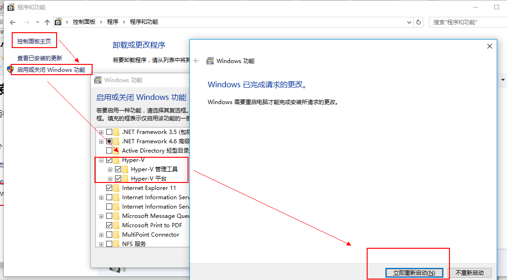
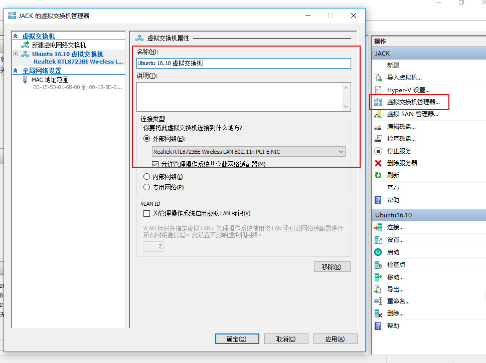
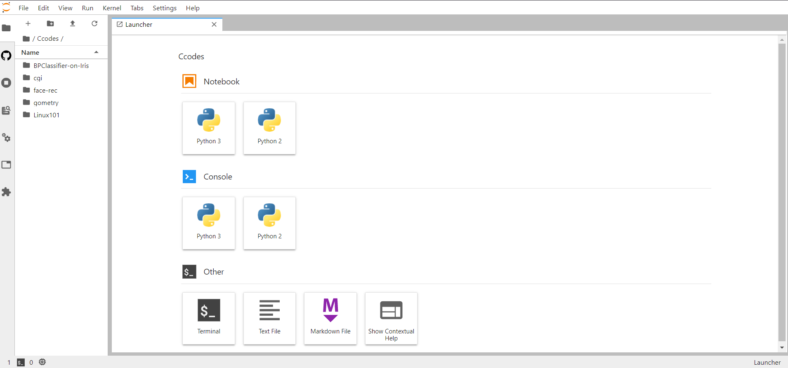
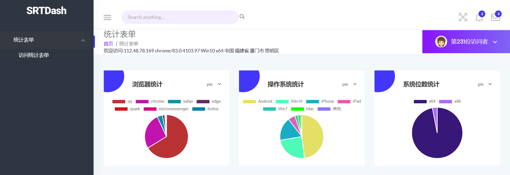
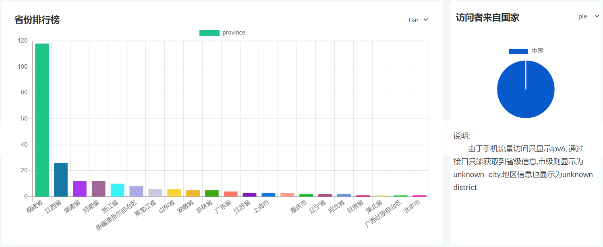
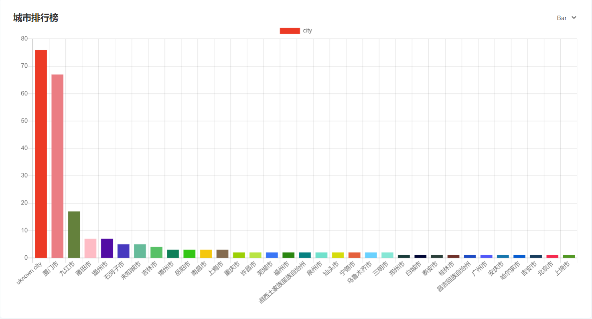
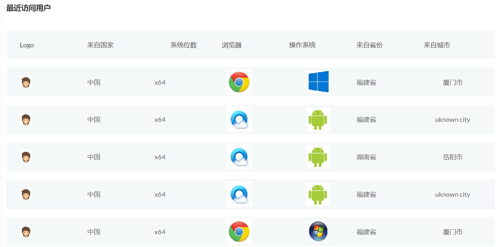

# [Linux CGI-网站统计](https://github.com/centurion-crawler/access-statistics)
demo [Count-anaysis](http://120.78.5.223/cgi-bin/count)

源码 [https://github.com/centurion-crawler/access-statistics](https://github.com/centurion-crawler/access-statistics)
## 基于Hyper-v的虚拟机创建
用Hyper-v有以下要求:
* Win10专业版
* 控制面板的开启或关闭windows功能中启用Hyper-v
* 足够的磁盘空间及内存

之后下载好对应的iso或者硬盘源文件 [ubuntu-18.04.3-desktop-amd64.iso](https://mirrors.tuna.tsinghua.edu.cn/ubuntu/)

### 开始创建虚拟机
#### 配置Hyper-v
打开安装好的Hyper-V管理器，右键选择创建虚拟机

修改虚拟机的名字为Ubuntu18.04，然后修改一下虚拟机存储的位置，建议放到空间比较大的一个盘上

之后分配内存、配置网络、新建虚拟磁盘、建议大小不超过60G

选择我们之前下载的Ubuntu18.04版的镜像文件，完成

后续也是可以对虚拟机进行设置的，比如把虚拟CPU加到四个核等等

接下来就是配置一个虚拟网络以供虚拟机使用：选择管理器右边的虚拟交换机管理器，打开并创建一个外部虚拟交换机，设置好名称之后选择一个可以访问外网的网络适配器，最后不要忘记将其重新设置为虚拟机的网络适配器


#### 安装系统
步骤包括：选择地区与语言、系统盘设置、用户及隐私

至此虚拟机和Linux系统创建完毕，详细可以参考:\
[How to install Ubuntu Desktop 18.04 LTS in Hyper-V on Windows 10](https://www.shaileshjha.com/how-to-install-and-setup-ubuntu-desktop-in-hyper-v-in-windows/)

## 配置Linux系统
### 设置国内源
原因：国外源太慢了，修改为国内源会快很多（~~废话~~）
#### aliyun 
##### 备份
`cp /etc/apt/sources.list /etc/apt/source.list.bak`

在`/etc/apt/sources.list`文件前面添加如下条目：
```
#添加阿里源
deb http://mirrors.aliyun.com/ubuntu/ bionic main restricted universe multiverse
deb http://mirrors.aliyun.com/ubuntu/ bionic-security main restricted universe multiverse
deb http://mirrors.aliyun.com/ubuntu/ bionic-updates main restricted universe multiverse
deb http://mirrors.aliyun.com/ubuntu/ bionic-proposed main restricted universe multiverse
deb http://mirrors.aliyun.com/ubuntu/ bionic-backports main restricted universe multiverse
deb-src http://mirrors.aliyun.com/ubuntu/ bionic main restricted universe multiverse
deb-src http://mirrors.aliyun.com/ubuntu/ bionic-security main restricted universe multiverse
deb-src http://mirrors.aliyun.com/ubuntu/ bionic-updates main restricted universe multiverse
deb-src http://mirrors.aliyun.com/ubuntu/ bionic-proposed main restricted universe multiverse
deb-src http://mirrors.aliyun.com/ubuntu/ bionic-backports main restricted universe multiverse
```
最后执行如下命令更新源
##### 更新
`sudo apt-get update && sudo apt-get upgrade`


### 搭建服务器
事实上，网页要被其他人访问需要公网IP，即在服务器上建站（~~那前面做的不都白费了~~）

#### 配置语言

```
# 首先要把服务器语言修改了，查看当前语言
> echo $LANG 
# 如果显示zh-cn.UTF-8 那么恭喜我自己，不用换了，否则查看本地语言
> locale
# 如果很遗憾，没有zh-cn.UTF-8 则需要手动安装
> sudo apt-get install  language-pack-zh-han*
# 支持检查
> sudo apt install $(check-language-support)
# 修改配置文件和环境文件
> vim /etc/default/locale 
> vim /etc/environment 
```
将原始内容注释掉或删掉，替换为如下内容：
```
LANG="zh_CN.UTF-8"
LANGUAGE="zh_CN:zh"
LC_NUMERIC="zh_CN"
LC_TIME="zh_CN"
LC_MONETARY="zh_CN"
LC_PAPER="zh_CN"
LC_NAME="zh_CN"
LC_ADDRESS="zh_CN"
LC_TELEPHONE="zh_CN"
LC_MEASUREMENT="zh_CN"
LC_IDENTIFICATION="zh_CN"
LC_ALL="zh_CN.UTF-8"
```
最后重启`reboot`

#### 搭建jupyter lab
由于终端命令行不方便操作(~~实在是太丑了~~)，而juypter lab较好地支持文本编写和环境运行，所以配置juypter势在必行

安装python3(可以指明版本)
`sudo apt-get install python3`

更换pip源：首先到~/.config/.pip目录下新建（或修改）pip.conf文件
然后在文件中输入如下信息：
```
[global]
index-url = http://mirrors.aliyun.com/pypi/simple/
```

```
# 安装jupyter lab
> pip3 install jupyter
# 生成配置文件
> jupyter notebook --generate-config
# 生成密钥
# 修改配置文件vim ~/.jupyter/jupyter_notebook_config.py
c=get_config()
c.IPKernelApp.pylab ="inline"
c.NotebookApp.ip='*'                # 设置所有ip皆可访问
c.NotebookApp.password = 'sha1:x'   # 刚生成的密文
c.NotebookApp.open_browser = False  # 禁止自动打开浏览器
c.NotebookApp.port = 9999           # 指定运行端口
c.NotebookApp.notebook_dir = '/home/apollo3d/tf/jupyter_home' # 指定Jupyter的工作目录
```

到此，JupyterLab已经安装成功了IP:[port]就能访问了，首次访问需要输入刚刚设置的密码

#### 安装LAPM
```
# apache2
> sudo apt-get install apache2
# php7.2
> sudo apt-get install php7.2
# MySQL
> sudo apt-get install mysql-server
# phpmyadmin
sudo apt-get install phpmyadmin
# /var/www目录的权限方便日后编辑网站文件
sudo chmod 777 /var/www
```
#### 安装CGI模块
打开文件`/etc/apache2/sites-enabled/000-default.conf`找到以下的内容：

`# Include conf-available/serve-cgi-bin.conf`

修改为：

`Include conf-available/serve-cgi-bin.conf`

打开文件`/etc/apache2/conf-available/serve-cgi-bin.conf`

`AllowOverride None`改为 `AllowOverride ALL`

加上`AddHandler cgi-script cgi` 

打开
`/etc/apache2/mods-available/cgid.load`
加上：
`AddHandler cgi-script .cgi .pl .py .sh`
(在后面加上允许网页加载的文件后缀)
```
# 重启Apache2
> sudo /etc/init.d/apache2 restart
# 并且要求能够被用户访问的页面都设置成755权限
> sudo chmod 755 /usr/lib/cgi-bin/*
```
至此，所有准备工作已就绪

## 网页设计
需求：
* 能对访问网站的用户进行分类统计
* 了解来自某个地区的、某个操作系统的、某个浏览器的用户是多少
  
C/C++ 的代码应该：
* 实现上述的网站统计工具的功能；
* 并遵守 Makefile 的代码规范
* 使用到自己编写的数据结构的相关库
* 调用别人写好的成熟的cgic的库

### 设计思路
用户信息来源
* Header(UserAgent)
* IP接口
#### 前端框架
* vue+ajax
#### 后端处理
* php+json文本(数据库)
* cgi(C++) 返回给前端信息

### 前端设计
#### 功能设计
##### Navigator 对象
Navigator 对象包含有关浏览器的信息

注：没有应用于 navigator 对象的公开标准，不过所有浏览器都支持该对象
###### Navigator 对象属性

<div style="  width: auto;  display: table;  margin-left: auto;
margin-right: auto;">

属性|描述
:--:|:--:
appCodeName|返回浏览器的代码名
appMinorVersion|返回浏览器的次级版本
appName|返回浏览器的名称
appVersion|返回浏览器的平台和版本信息
browserLanguage|返回当前浏览器的语言
cookieEnabled|返回指明浏览器中是否启用 cookie 的布尔值
cpuClass|返回浏览器系统的 CPU 等级
onLine|返回指明系统是否处于脱机模式的布尔值
platform|返回运行浏览器的操作系统平台
systemLanguage|返回 OS 使用的默认语言
userAgent|返回由客户机发送服务器的 user-agent 头部的值
userLanguage|返回 OS 的自然语言设置

</div>

###### Navigator 对象方法

<div style="  width: auto;  display: table;  margin-left: auto;
margin-right: auto;">

方法|描述
:--:|:--:
javaEnabled()|规定浏览器是否启用 Java
taintEnabled()|规定浏览器是否启用数据污点 (data tainting)

</div>

##### IP接口+Ajax
[接口说明](https://lbs.qq.com/service/webService/webServiceGuide/webServiceIp),以下是搬运
###### 概述

通过终端设备IP地址获取其当前所在地理位置，精确到市级，常用于显示当地城市天气预报、初始化用户城市等非精确定位场景。
###### 请求URL及参数
`https://apis.map.qq.com/ws/location/v1/ip`

<div style="  width: auto;  display: table;  margin-left: auto;
margin-right: auto;">

参数|必填|说明|示例
:--:|:--:|:--:|:--:
ip|否|IP地址，缺省时会使用请求端的IP|ip=202.106.0.20
key|是|开发密钥（Key）| key=OB4BZ-D4W3U-B7VVO-4PJWW-6TKDJ-WPB77
output|否|返回格式：支持JSON/JSONP，默认JSON|output=json
callback|否|JSONP方式回调函数|callback=function1

</div>

###### 响应结果
<div style="  width: auto;  display: table;  margin-left: auto;
margin-right: auto;">

名称|类型|必填|说明
:--:|:--:|:--:|:--:
status|number|是|状态码: 0为正常<br>310请求参数信息有误 311Key格式错误<br>306请求护持信息请检查字符串 110请求来源未被授权
message|string|是|对status的描述
result|object|是|IP定位结果
ip|string|是|用于定位的IP地址
location|object|是|定位坐标
lat|number|是|纬度
lng|number|是|经度
ad_info|object|是|定位行政区划信息
nation|string|是|国家
province|string|是|省
city|string|否|市
district|string|否|区
adcode|number|是|行政区划代码

</div>

我们只需要获得位置信息nation,province,city,district
对应js关键部分如下：
###### 发送数据
```
$.ajax({
  type: 'get',//接口规定，只能用get
  async: true,//异步
  url: 'https://apis.map.qq.com/ws/location/v1/ip',//接口地址
  data: {'key':'API-key' ,'output':'jsonp'},//参数格式必须用到output传参为jsonp，否则会报跨域问题
  dataType: 'jsonp',//跨域，必须用到jsonp
  success: function(result){
        //console.log(JSON.stringify(result));
        output.IP=result['result']['ip'];//数据提取
        output.country=result['result']['ad_info']['nation'];
        output.province=result['result']['ad_info']['province'];
        output.city=result['result']['ad_info']['city']
        output.district=result['result']['ad_info']['district'];
        if (output.city=='') output.city='未知城市';
        if (output.district=='') output.district='未知地区';
        document.getElementById('userinfo').innerHTML='欢迎访问:'+output.IP+' '+output.Browser+' '+output.OS+
        ' '+output.digits+' '+output.country+' '+output.province+' '+output.city+' '+output.district+' ';
        document.getElementById('userip').innerHTML=output.IP;
        document.getElementById('userbrowser').innerHTML=output.Browser;
        document.getElementById('useros').innerHTML=output.OS;
        document.getElementById('num1').innerHTML=usernum;
        document.getElementById('num2').innerHTML=usernum;
        var json =JSON.stringify(output);//使用JSON将对象转换成JSON格式数据
        var xhr = new XMLHttpRequest;
        xhr.open('post', './all.php');
        xhr.setRequestHeader('Content-Type', 'application/x-www-form-urlencoded');
        xhr.send('user=' + json);
//Content-Type设置成application/x-www-form-urlencoded情况下请求主体可以用key1=value1&key2=value2的形式发送数据
        xhr.onreadystatechange = function() {
                if(xhr.readyState == 4 && (xhr.status == 200 || xhr.status ==304))  //响应完成并且响应码为200或304
                    console.log('OK');
        }
    },
```
###### 美化处理
* [bootstrap](https://github.com/twbs/bootstrap) 最受欢迎的HTML，CSS和JavaScript框架，用于在网络上开发响应式，移动优先项目。
* [Chart.js](https://github.com/chartjs/Chart.js) 基于canvas的统计绘图框架 
* [fontwsesome](https://github.com/FortAwesome/react-fontawesome) 使用SVG和JS的Font Awesome 5 组件

**Chart实现**

首先,需要在页面中要有一个画布 
```<canvas id="myChart"></canvas>```

调用js
```<script src="https://cdn.jsdelivr.net/npm/chart.js@2.8.0"></script>```

然后在canvas上建立chartdemo
```
var ctx = document.getElementById('myChart').getContext('2d');
var chart = new Chart(ctx, {
    // The type of chart we want to create
    type: 'line',

    // The data for our dataset
    data: {
        labels: ['January', 'February', 'March', 'April', 'May', 'June', 'July'],
        datasets: [{
            label: 'My First dataset',
            backgroundColor: 'rgb(255, 99, 132)',
            borderColor: 'rgb(255, 99, 132)',
            data: [0, 10, 5, 2, 20, 30, 45]
        }]
    },
    // Configuration options go here
    options: {}
});
```
于是只要从后端调用数据写入data和label
具体实现见源码和之后的[后端设计](#后端设计)

### 后端设计
主要是对ajax发送的数据进行处理并显示在页面上
#### 功能设计
##### 数据处理php
前端接口已经处理好，php只要把jsonp的数据传为字符串写入文件(user.json)或者数据库
##### CGI
* count_anaysis.cpp(main)
* count.cpp
* html.cpp
* origin.cpp(all in one)


文件|功能
:--:|:--:
count.cpp|处理user.json中的用户数据并给到前端接口
html.cpp|主要显示前端代码
origin.cpp|所有代码的整合版本

###### 数据结构描述
* 主要利用线性表进行统计，算法复杂度为O(N)
* 后期可以利用外存实现优化
用户类
>`class user`
>— `string info` 
>— `function getinfo`

标签类
>`class property`
>— `string ts` 
>— `int tn`

分类统计
> `vector<property> attr` 

[具体详见代码注释](https://www.github.com/centurion-crawler/access-statistics/blob/master/include/count.hpp)
##### Makefile

* 分为三个文件进行编译
* 依赖关系为count_anaysis->html->count

注意：由于`make`编译时需要依赖文件放在被依赖文件前面，所以编译顺序按上面进行。

至此网页实现完成。

## 结果展示
##### 统计图表
注：图表右上方有选择栏供用户选择图标形式（Bar,Pie,Line)





#### 历史用户


#### [演示动画](./video/SHOW.mp4)
<iframe width="880" height="505" src="./video/SHOW.mp4" frameborder="0" allowfullscreen></iframe>

## 总结
通过这次CGI编程我学会了：
* 如何编写html、css、javascript
* 如何利用ajax POST前端页面信息
* 后端php处理信息及处理文件
* CGI显示后端信息，面向对象模块化编程
* Makefile规范

Copyright©centurion-crawler 2020 (Linux Final CGI-count)